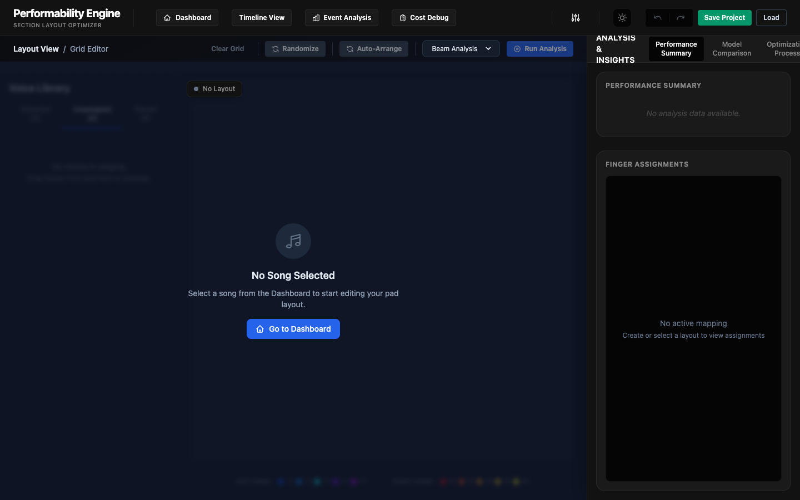
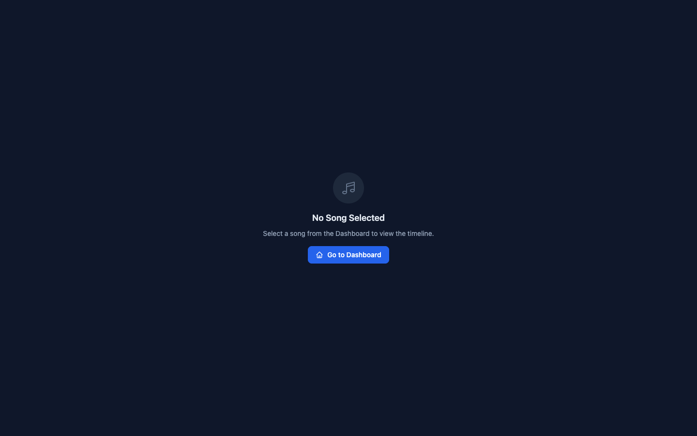

# Performance-ergonomics-optimization-engine-for-Ableton-Push
Analyzes MIDI, evaluates playability, and generates musician-adaptive pad layouts with a visual remapping workbench

## Features & Views

### Workbench (Layout Editor)
Interactive grid to assign sounds, run the ergonomic optimization solver, and visualize the generated finger assignments.

### Event Analysis
Review the physical difficulty of the pad layout, with detailed transition metrics, hand balance constraint tracking, and ergonomic scores.

### Timeline View
Review the generated layout chronologically, analyzing the sequence of grip transitions over the performance.

### Architecture 

The Performability Engine is an ergonomics-driven optimization system for performing electronic music on the Ableton Push.

It analyzes MIDI performances, evaluates the physical difficulty of pad layouts, and uses a modular cost engine (movement, simultaneity, gesture naturalness, cognitive grouping, and muscle-memory stability) to recommend musician-adaptive remappings.

System Inputs
  Performance object (MIDI → NoteEvent[]) from existing services
  Initial grid mapping (random or default layout)
  Tempo / BPM

System Outputs
  Optimized results include:
  Sound → Pad map
  Hand assignment
  Fingering assignment
  Full cost breakdown (static, transition, drumming costs)
  Charts and metrics for visualization

**Cost Metrics** 
The cost function combines multiple ergonomics and performance factors:

C_total = C_static + C_transition + C_special + C_home + C_pattern

**Static Cost — “Grip Cost”**

Evaluated per event cluster (simultaneous notes / chords).

  A. Stretch
  
    Exponential penalty for finger span beyond neutral shape:
    
    C_stretch = exp( k * (d_max - d_0))

  B. Collisions
  
    Infinite cost if left/right hands overlap.
    Infinite cost if finger topology (x-ordering rules) is violated.

  C. Finger Strength
  
    Finger weights:
    
    index / middle → low cost
    ring / pinky → higher cost
    thumb → special constraints (restricted vertical range)
    4.2 Transition Cost — “Movement Cost”

  A. Hand Travel
  
    Distance between hand centroids from event → event.
    
    B. Micro-movement
    
    Finger-level movement weighted by finger strength.
    
    C. Fitts’s Law
    
    Used to determine speed feasibility:
    
    T = a + b * log2(D/W + 1)
    If required movement time T exceeds the allowable time (derived from BPM), the event becomes infeasible (infinite cost).

**Special Drumming Costs**

  A. Hand Alternation
    
    Reward alternating hands (L→R→L→R) for fast streams.
    
  B. Finger Alternation
    
    Reward Index→Middle for repeats; penalize repeated use of the same finger (Index→Index).

**Home Position “Attractor” Model**
[TODO = Update to use the per finger model]

  Define home positions:
    Left hand: (2, 2)
    Right hand: (5, 2)
    Penalty for drift from home:
  
    C_home = α * || H_t - H_home ||²
    Where α is a tunable stiffness parameter.

**Pattern-Memory Standardization**

    For patterns identified via relative encoding:

    If the same geometric pattern appears later, encourage reusing the same fingering.
    Pattern reward:
    
    C_pattern = -β * matchScore
    5. Search-Space Pruning (CLP Concepts)

Grip Dictionary

    Precompute for all 2, 3, and 4-note combinations:
    
    Valid finger assignments
    Valid hand assignments
    Reachability mask (respecting anatomical limits)
    5.2 Constraints Applied Before Optimization
    
    Topological ordering (no finger crossover)
    Maximum hand span limits
    Natural anatomical variance (relative finger heights, y-ordering rules)
    These constraints dramatically reduce the search space for the optimizer.

V0

